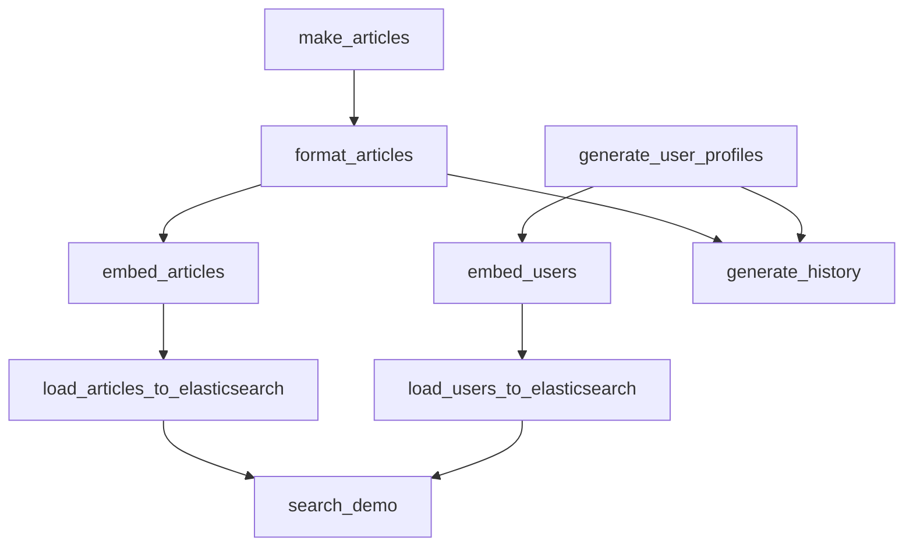

```mermaid
flowchart TD
	node1["embed_articles"]
	node2["embed_users"]
	node3["format_articles"]
	node4["generate_history"]
	node5["generate_user_profiles"]
	node6["load_articles_to_elasticsearch"]
	node7["load_users_to_elasticsearch"]
	node8["make_articles"]
	node9["search_demo"]
	node1-->node6
	node2-->node7
	node3-->node1
	node3-->node4
	node5-->node2
	node5-->node4
	node6-->node9
	node7-->node9
	node8-->node3
```
