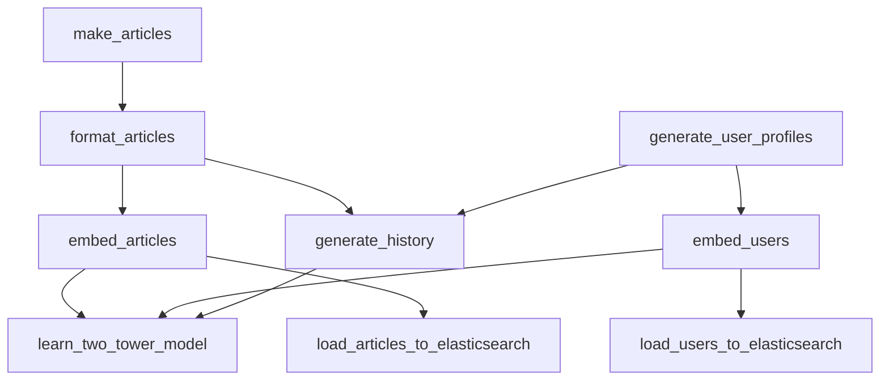

```mermaid
flowchart TD
	node1["embed_articles"]
	node2["embed_users"]
	node3["format_articles"]
	node4["generate_history"]
	node5["generate_user_profiles"]
	node6["learn_two_tower_model"]
	node7["load_articles_to_elasticsearch"]
	node8["load_users_to_elasticsearch"]
	node9["make_articles"]
	node1-->node6
	node1-->node7
	node2-->node6
	node2-->node8
	node3-->node1
	node3-->node4
	node4-->node6
	node5-->node2
	node5-->node4
	node9-->node3
```
