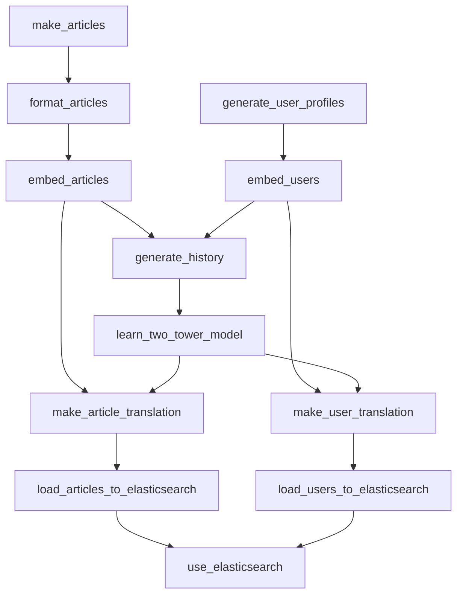

```mermaid
flowchart TD
	node1["embed_articles"]
	node2["embed_users"]
	node3["format_articles"]
	node4["generate_history"]
	node5["generate_user_profiles"]
	node6["learn_two_tower_model"]
	node7["load_articles_to_elasticsearch"]
	node8["load_users_to_elasticsearch"]
	node9["make_article_translation"]
	node10["make_articles"]
	node11["make_user_translation"]
	node12["use_elasticsearch"]
	node1-->node4
	node1-->node9
	node2-->node4
	node2-->node11
	node3-->node1
	node4-->node6
	node5-->node2
	node6-->node9
	node6-->node11
	node7-->node12
	node8-->node12
	node9-->node7
	node10-->node3
	node11-->node8
```
