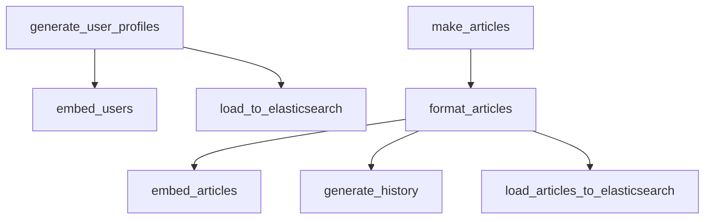

```mermaid
flowchart TD
	node1["embed_users"]
	node2["generate_user_profiles"]
	node3["load_to_elasticsearch"]
	node2-->node1
	node2-->node3
	node4["embed_articles"]
	node5["format_articles"]
	node6["generate_history"]
	node7["load_articles_to_elasticsearch"]
	node8["make_articles"]
	node5-->node4
	node5-->node6
	node5-->node7
	node8-->node5
```
